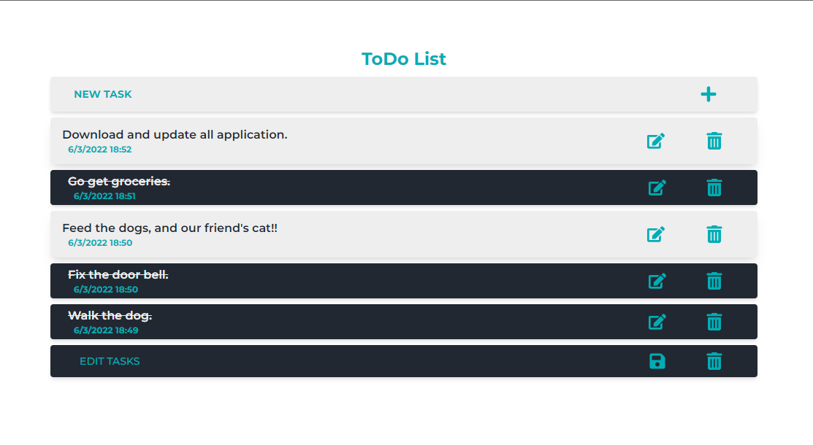
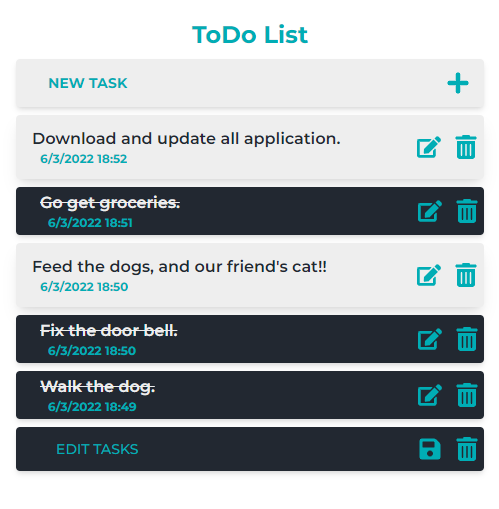

# Todo list App made with React:

#### Live Demo: [ToDo List](https://ayoubmazouz.github.oi/todo-list)

### In this application you:

- Write your tasks.
- Check tasks as complete.
- Edit tasks.
- Delete tasks.

The tasks are stored in LocalStorage.

### Some screenshots:

